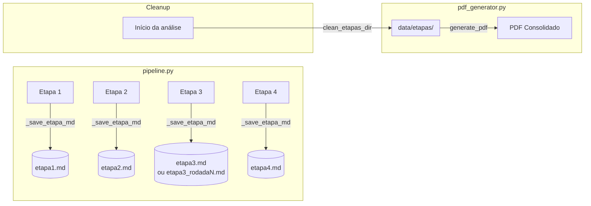

# Data Model: Estruturar Etapas do Pipeline em Markdown

## Entities

### Entity: Arquivo de Etapa (Stage File)

Arquivo markdown individual representando o resultado de uma etapa do pipeline.

| Campo | Tipo | Descrição | Obrigatório |
|-------|------|-----------|-------------|
| `filename` | `string` | Nome do arquivo (ex: `etapa1.md`, `etapa3_rodada5.md`) | Sim |
| `stage_number` | `int` | Número da etapa (1-4) | Sim |
| `run_index` | `int \| None` | Índice da rodada (apenas para modo 10x, etapa 3) | Não |
| `title` | `string` | Cabeçalho H1 do conteúdo (ex: `# Etapa 1 — Extração de Metadados`) | Sim |
| `content` | `string` | Conteúdo markdown bruto da resposta da IA | Sim |
| `is_empty` | `bool` | `True` se o conteúdo original estava vazio (fallback inserido) | Sim |

**Validation Rules**:
- `filename` DEVE seguir o padrão `etapa{N}.md` ou `etapa3_rodada{N}.md`
- `stage_number` DEVE ser 1, 2, 3 ou 4
- `content` NÃO DEVE ser `None` — se vazio, usar fallback "Nenhum conteúdo disponível para esta etapa."
- `run_index` DEVE ser 1-10 apenas quando `stage_number == 3`

---

### Entity: Diretório `data/etapas/`

Diretório centralizador de todos os arquivos de etapa, limpo a cada nova análise.

| Campo | Tipo | Descrição |
|-------|------|-----------|
| `path` | `Path` | Caminho absoluto: `<ROOT_DIR>/data/etapas/` |
| `files` | `list[Path]` | Lista de arquivos .md ordenados alfabeticamente |
| `is_clean` | `bool` | `True` se o diretório contém apenas arquivos da análise atual |

**State Transitions**:
1. `INICIAL` → Diretório pode não existir
2. `CRIADO` → Diretório criado via `mkdir(parents=True, exist_ok=True)`
3. `LIMPO` → Todos os arquivos .md removidos antes de nova análise
4. `PREENCHIDO` → Arquivos .md escritos conforme etapas são concluídas
5. `CONSUMIDO` → `generate_pdf()` leu os arquivos e gerou o PDF

---

### Entity: PDF Consolidado

Documento final gerado a partir dos arquivos de etapa.

| Campo | Tipo | Descrição |
|-------|------|-----------|
| `output_path` | `Path` | Caminho de saída (ex: `data/relatorio_consolidado.pdf`) |
| `etapas_dir` | `Path` | Diretório de origem dos arquivos .md |
| `page_count` | `int` | Número de páginas (determinado no two-pass build) |
| `is_valid` | `bool` | `True` se passou na validação `_validate_pdf()` |

---

## Relationships



---

## File Format Contract

### Padrão de Nomenclatura

| Modo | Arquivos Gerados |
|------|-----------------|
| 1x | `etapa1.md`, `etapa2.md`, `etapa3.md`, `etapa4.md` |
| 10x | `etapa1.md`, `etapa2.md`, `etapa3_rodada1.md` ... `etapa3_rodada{N}.md`, `etapa4.md` |

### Conteúdo do Arquivo

```markdown
# Etapa N — Nome da Etapa

[conteúdo markdown bruto retornado pela IA]
```

- O cabeçalho H1 (`# Etapa N — Nome`) é adicionado pelo pipeline
- O conteúdo abaixo do cabeçalho é o texto bruto retornado por `run_llm_stage_streaming()`
- Se o conteúdo for vazio, o arquivo conterá apenas: `Nenhum conteúdo disponível para esta etapa.`
