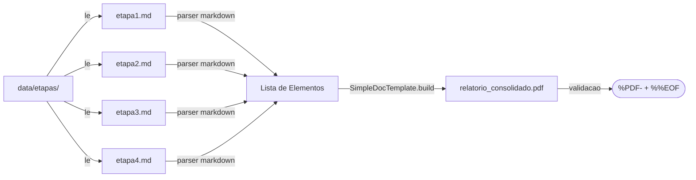

# Data Model: Refatorar PDF para estilo simples

## Entities

### Entity: Arquivo de Etapa (`.md`)

Arquivo markdown em `data/etapas/` contendo a saída de uma etapa do pipeline.

| Campo | Tipo | Descrição | Exemplo |
|-------|------|-----------|---------|
| `filename` | `string` | Nome do arquivo (ordem alfabética) | `etapa1.md` |
| `path` | `Path` | Caminho completo do arquivo | `C:/radiantev2/data/etapas/etapa1.md` |
| `content` | `string` | Conteúdo textual markdown | Conteúdo do arquivo |
| `lines` | `list[string]` | Linhas do conteúdo | Split por `\n` |

---

### Entity: Elemento PDF

Bloco de conteúdo renderizado no PDF. Cada elemento é um flowable do ReportLab.

| Tipo | Classe ReportLab | Uso | Quebra página? |
|------|-----------------|-----|----------------|
| Título H1 | `Paragraph` (Helvetica-Bold 16pt) | `# Título` | Sim (automática) |
| Título H2 | `Paragraph` (Helvetica-Bold 14pt) | `## Seção` | Sim |
| Título H3 | `Paragraph` (Helvetica-Bold 12pt) | `### Subseção` | Sim |
| Texto | `Paragraph` (Helvetica 11pt) | Linhas de texto comum | Sim |
| Código | `Paragraph` (Courier 9pt) | Bloco entre ``` | Sim |
| Tabela | `Table` (Helvetica 9pt) | Linhas com `\|` | Sim (se `repeatRows` definido) |
| Espaçador | `Spacer` | Linhas em branco | N/A |

---

### Entity: PDF Consolidado

Arquivo PDF gerado em `data/relatorio_consolidado.pdf`.

| Atributo | Descrição | Validação |
|----------|-----------|-----------|
| `path` | Caminho do PDF gerado | Arquivo existe |
| `header` | Cabeçalho do arquivo | Inicia com `%PDF-` |
| `footer` | Marcador de fim | Termina com `%%EOF` |
| `pages` | Número total de páginas | >= 1 |
| `elements` | Lista de Elementos PDF | Não vazia |

---

## Relationships



---

## Validação

### Validação pós-geração

| Regra | Descrição | Ação se falhar |
|-------|-----------|----------------|
| Arquivo existe | `output_path.exists()` | `RuntimeError` |
| Cabeçalho PDF | `data.startswith(b"%PDF-")` | `RuntimeError` |
| Marcador EOF | `data.strip().endswith(b"%%EOF")` | `RuntimeError` |

### Tratamento de erro

| Cenário | Ação |
|---------|------|
| Erro no Pass 1 (contagem) | Remover `.tmp.pdf`, remover `output_path`, relançar exceção |
| Erro no Pass 2 (build final) | Remover `output_path`, relançar exceção |
| `data/etapas/` não existe | Lançar `FileNotFoundError` |
| Nenhum arquivo `.md` | Gerar PDF com mensagem "Nenhum conteúdo disponível" |
